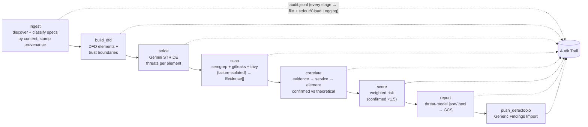

# AI Threat-Modeling Pipeline

[](https://cloud.google.com)
[](#)
[](https://www.terraform.io)
[](#)
[](#)
[](#)
[](#)
[](#)
[](#)
[](#)
[](#)

> An AI-assisted threat-modeling pipeline that does not merely *theorize* threats but *confirms* them with real scanner evidence that produces an honest, evidence-weighted risk score.

---

## Summary

This project runs as a single, locked-down **Cloud Run Job** inside an enterprise-grade GCP environment (CMEK everywhere, private-only egress, VPC-SC-ready). It ingests an architecture description and an OpenAPI spec, uses a **LangGraph** agent to build a Data-Flow Diagram (DFD) with trust boundaries, asks **Gemini** (Vertex AI) to generate **STRIDE** threats per element, then runs three co-located security scanners **Semgrep** (SAST), **gitleaks** (secrets), **Trivy** (SCA) over the target source tree to produce *real evidence*. It correlates that evidence to the theoretical threats, labels each **confirmed** vs **theoretical**, computes a weighted risk score, pushes findings to a **DefectDojo** dashboard, and writes a JSON/HTML report plus a JSONL audit trail of every stage.

**The differentiator:** a theoretical threat only becomes *confirmed* when a scanner finds corroborating evidence in the service that threat targets, so the risk score reflects proven risk, not LLM speculation.

Sample application under test: [OWASP **crAPI**](https://github.com/OWASP/crAPI) (deliberately vulnerable API).

---

## Table of Contents

- [Architecture](#architecture)
- [Data Flow](#data-flow)
- [Key Design Decisions](#key-design-decisions)
- [FastMCP CLI Wrappers](#fastmcp-cli-wrappers)
- [Enabled APIs](#enabled-apis)
- [GCP Services & Resources](#gcp-services--resources)
- [Identity & Access Design](#identity--access-design)
- [Network Design](#network-design)
- [Environment Variable Contract](#environment-variable-contract)
- [Key Steps Required for Success](#key-steps-required-for-success)
- [Correlation: From Naive 1:1 to Evidence-Weighted](#correlation-from-naive-11-to-evidence-weighted)
- [Key Issues & Troubleshooting](#key-issues--troubleshooting)
- [Key Logs That Drove Decisions](#key-logs-that-drove-decisions)
- [Repository Layout](#repository-layout)

---

## Architecture

```mermaid
flowchart LR
    %% Professional Color Palettes
    classDef compute fill:#1a365d,stroke:#2b6cb0,color:#fff,stroke-width:2px;
    classDef storage fill:#2d3748,stroke:#4a5568,color:#fff,stroke-width:2px;
    classDef security fill:#742a2a,stroke:#9b2c2c,color:#fff,stroke-width:2px;
    classDef external fill:#2c5282,stroke:#3182ce,color:#fff,stroke-width:2px;
    classDef default fill:#edf2f7,stroke:#cbd5e0,color:#1a202c,stroke-width:1px;

    %% 1. Staging Boundary (Left)
    subgraph DEV["Staging VM (Public Egress)"]
        GIT["Git Repo + Specs"]
        STAGE["stage_run.sh<br/>• Clone crAPI @ SHA<br/>• Write provenance.json"]
    end
    class DEV default;
    class STAGE compute;

    %% 2. Secure Cloud Storage & Logging (Middle-Left)
    subgraph GCS["Google Cloud Storage (CMEK Secured)"]
        INB["ai-threatmodel-inputs<br/>runs/sha/{source,specs,provenance}<br/>[Read-Only to Job]"]
        REP["ai-threatmodel-reports<br/>• threat-model.json<br/>• threat-model.html"]
    end
    LOG["Cloud Logging (jsonPayload)<br/>• Structured Audit Logs"]
    class GCS default;
    class INB,REP storage;
    class LOG external;

    %% 3. Private VPC Boundary (Middle-Right)
    subgraph VPC["prod-security-vpc (Private Egress Only)"]
        
        subgraph JOB["Cloud Run v2 Job: threat-model-pipeline (Gen2)"]
            LG["LangGraph Orchestrator<br/>(ingest ➔ dfd ➔ stride ➔ scan ➔ correlate ➔ score ➔ report ➔ push)"]
            
            subgraph MCP["Co-located FastMCP stdio servers (Isolated venvs)"]
                SG["semgrep_server.py<br/>(Local Semgrep CLI)"]
                GL["gitleaks_server.py<br/>(Local Gitleaks CLI)"]
                TV["trivy_server.py<br/>(Local Trivy CLI)"]
            end
        end

        DD["DefectDojo VM (e2-small)<br/>Local PostgreSQL<br/>10.0.1.10:8080"]
        PSC["PSC Endpoint<br/>(Google APIs Router)<br/>+ 4 Private DNS Zones"]
    end
    class VPC default;
    class JOB,LG,MCP,SG,GL,TV,DD compute;
    class PSC external;

    %% 4. External Cloud Dependencies (Right & Bottom)
    VAI["Vertex AI API<br/>Gemini 3.5 Flash (Global Endpoint)"]
    KMS["Cloud KMS<br/>sec-keyring (4 CMEK Keys)"]
    SM["Secret Manager [CMEK]<br/>• defectdojo-token<br/>• zap-api-key"]
    AR["Artifact Registry [CMEK]<br/>security-tools/threat-model-pipeline"]
    
    class VAI,SM,AR external;
    class KMS security;

    %% Edge Connections (Left-to-Right Data Flow)
    GIT --> STAGE
    STAGE -->|Uploads Source & Specs| INB
    
    INB -->|gcsfuse RO Mount /mnt/inputs| LG
    LG --> MCP
    LG --> REP
    LG -->|Findings POST via Private IP| DD
    JOB -->|stdout JSON| LOG
    AR -->|image pull| JOB
    
    %% Security & Network Control Connections
    JOB -->|Direct VPC Egress| PSC
    PSC --->|Private API Call| VAI
    PSC --->|Private API Call| GCS
    SM --->|Secrets injected as env at job start| JOB
    
    KMS -.->|CMEK Decrypt/Encrypt| GCS
    KMS -.->|CMEK Decrypt| SM
    KMS -.->|CMEK Decrypt| JOB
    KMS -.->|CMEK Decrypt| AR
```


DefectDojo is **not** part of the job image, it is a separate, persistent service (Compute Engine VM with local Postgres). The pipeline is a client that POSTs findings to it over the private path.


## Data Flow




Two distinct inputs (do not conflate):

- **Spec inputs** → `ingest` (architecture YAML + OpenAPI). Discovered/classified by content, not filename.
- **Scan target** (source tree) → `scan` (the evidence path). `SOURCE_DIR`; scanners walk the whole tree.

---

## Key Design Decisions

| # | Decision | Rationale |
|---|----------|-----------|
| 1 | **All scanners are FastMCP wrappers over the CLI**, each in its own venv | `semgrep mcp` can't run offline (phones home at boot); gitleaks has no MCP; I avoided the Trivy MCP plugin. Uniform, offline, no dependency-pin collisions. See [FastMCP CLI Wrappers](#fastmcp-cli-wrappers). |
| 2 | **Honest scoring** and no fabricated evidence | A scanner that can't run is recorded as `scanner_skipped`; a "0 findings" is never invented. Trivy emits **coverage telemetry** so "assessed clean" is distinguishable from "couldn't assess." |
| 3 | **Everything offline at runtime** | Trivy vuln DB baked at build; Semgrep curated rule packs baked at build; metrics/version-checks disabled. Deny-all egress means no registry/phone-home at scan time. |
| 4 | **Inputs delivered via GCS run-prefix** (gcsfuse, read-only, CMEK) | Immutable, content-addressed, auditable inputs; clean read/write split (pipeline reads, staging VM writes). |
| 5 | **Source provenance** stamped at staging time | The scanned tree ships without `.git`; the staging VM resolves the commit SHA and writes `provenance.json`, which `ingest` records as reproducible, attributable evidence. |
| 6 | **Data-driven correlation** (manifest ownership map) with crAPI heuristic fallback | Attribution of finding→service is app-specific; externalizing it as data makes the pipeline portable beyond crAPI without code changes. |
| 7 | **DefectDojo as a separate persistent service** | It's a stateful Django+Postgres app that accumulates findings across runs and is incompatible with an ephemeral run-to-completion job. Client/server, reached privately. |
| 8 | **Audit trail to stdout + file** | stdout JSON lands in Cloud Logging `jsonPayload`, making every stage queryable; the file is the local trail and is uploaded to GCS. |
| 9 | **CMEK everywhere + private-only egress + VPC-SC-ready** | Enterprise posture: customer-managed keys on GCS/AR/Secrets/Run, PSC for Google APIs, private DNS, default-deny egress scoped to the runtime SA. |

---

## FastMCP CLI Wrappers

All three scanners run as **co-located stdio MCP servers**, but instead of each tool's native MCP I ship thin **FastMCP wrappers** that shell out to the CLI. Each wrapper runs in its **own venv** (only `fastmcp` + stdlib) and invokes the scanner binary on `PATH`, so FastMCP's `mcp` pin can never collide with a scanner's bundled dependencies.

```
mcp_servers/
  semgrep_server.py   → /opt/semgrep-mcp/bin/python   → semgrep scan --config /opt/semgrep-rules
  gitleaks_server.py  → /opt/gitleaks-mcp/bin/python  → gitleaks dir
  trivy_server.py     → /opt/trivy-mcp/bin/python     → trivy fs --scanners vuln --skip-db-update
```

Why wrappers instead of native MCP:

- **Semgrep** — the built-in `semgrep mcp` server **phones `semgrep.dev` at startup** (OAuth authorization-server discovery) and dies on `ConnectTimeout` under locked-down egress. `semgrep scan` does none of that, so the wrapper runs it offline with a baked ruleset.
- **gitleaks** — has no official MCP server (an open upstream feature request). It's a Go binary emitting clean JSON.
- **Trivy** — I deliberately avoided the Trivy MCP plugin to stay offline-safe and explicit; the wrapper runs `trivy fs` with the baked DB.

Two FastMCP gotchas handled in the wrappers:

- `mcp.run(transport="stdio", show_banner=False)` As FastMCP's startup banner makes an outbound **PyPI version-check** that deny-all egress blocks; `show_banner=False` suppresses it.
- The orchestrator's MCP client forwards the **full process env** to each child (the default MCP behavior passes only a tiny subset) so `SEMGREP_SEND_METRICS=off` and Trivy's DB-cache `HOME` reach the scanner.

The Trivy wrapper additionally returns **coverage telemetry** (targets scanned, packages inventoried, per-manifest findings) so the pipeline can tell "assessed and clean" apart from "no concrete versions to assess", surfaced as `scanner_coverage_gap` when relevant.

---

## Enabled APIs

Enabled via `infra/apis.tf`:

`aiplatform` · `run` · `artifactregistry` · `secretmanager` · `storage` · `iam` · `compute` · `dns` · `cloudkms` · `containerscanning` (AR auto vuln scan) · `accesscontextmanager` (VPC-SC)

---

## GCP Services & Resources

**Project:** `ai-threatmodel` (number `969754568326`) · **Region:** `us-central1` · **Zone:** `us-central1-a`

| Area | Resource | Name / value |
|------|----------|--------------|
| Compute | Cloud Run v2 **Job** | `threat-model-pipeline` (gen2, direct VPC egress, CMEK `run-key`, `launch_stage=BETA`) |
| Compute | **DefectDojo** VM | `defectdojo` (e2-small, static internal IP `10.0.1.10`, 2 GB swap, Docker + local PostgreSQL) |
| Registry | Artifact Registry (DOCKER, CMEK) | `security-tools` |
| Storage | Reports bucket (CMEK, UBLA, PAP, versioned) | `ai-threatmodel-reports` |
| Storage | Inputs bucket (CMEK, read-only to pipeline) | `ai-threatmodel-inputs` |
| KMS | Keyring + 4 CMEK keys | `sec-keyring` → `gcs-key`, `secrets-key`, `artifact-key`, `run-key` |
| Secrets | Secret Manager (CMEK `secrets-key`) | `defectdojo-token`, `zap-api-key` |
| Network | VPC + subnet | `prod-security-vpc` / `sb-us-central1-secure` (`10.0.1.0/24`, PGA on) |
| Network | PSC for Google APIs | global internal address `psc-google-apis-ip` (`10.10.0.100`) + global forwarding rule (**created out-of-band**, see issues) |
| Network | 4 private DNS zones → PSC IP | `googleapis.com`, `pkg.dev`, `gcr.io`, `run.app` |
| Network | Firewall | deny-all egress (SA-scoped) + allow Google-private + allow DefectDojo + ingress DefectDojo (app/SSH) |

---

## Identity & Access Design

Least-privilege, resource-scoped where possible. Three identities:

**`threat-model-agent@…` — runtime SA** (what the job runs as):
- `roles/aiplatform.user` (project, required for prediction)
- `roles/storage.objectAdmin` on the **reports** bucket only
- `roles/storage.objectViewer` on the **inputs** bucket only (read-only)
- `roles/artifactregistry.reader` on the repo
- `roles/secretmanager.secretAccessor` on `defectdojo-token` and `zap-api-key`

**`defectdojo-vm@…` — DefectDojo VM SA:**
- `roles/logging.logWriter`, `roles/monitoring.metricWriter`

**`infra-manager-sa@…` — deployment SA** (Infrastructure Manager actuation). Needs broad provisioning rights, either `roles/owner`, or the scoped set:
`roles/serviceusage.serviceUsageAdmin`, `roles/iam.serviceAccountAdmin`, **`roles/iam.serviceAccountUser`** (to attach SAs to the job/VM), `roles/resourcemanager.projectIamAdmin`, `roles/compute.admin`, `roles/cloudkms.admin`, `roles/dns.admin`, `roles/storage.admin`, `roles/secretmanager.admin`, `roles/artifactregistry.admin`, `roles/run.admin`.

**Google-managed service agents:** each given `roles/cloudkms.cryptoKeyEncrypterDecrypter` on its key (GCS, Secret Manager, Artifact Registry, Cloud Run) CMEK fails silently without these. The Cloud Run service agent gets `roles/artifactregistry.reader` to pull the image.

> The staging VM identity needs **write** to the inputs bucket (`roles/storage.objectAdmin`) set `staging_writer_member` in `terraform.tfvars`, or run `stage_run.sh` as an owner identity.

---

## Network Design

- **Custom VPC** (`auto_create_subnetworks=false`) with one subnet, **Private Google Access** on. Custom VPCs have no implicit allow rules, so every path is explicit.
- **PSC for Google APIs**: a *global* internal address (`purpose=PRIVATE_SERVICE_CONNECT`) + a *global* forwarding rule (`load_balancing_scheme=""`, `--target-google-apis-bundle=all-apis`). All Google API traffic (Vertex AI, GCS, AR, Secret Manager) traverses this private endpoint.
- **4 private DNS zones** (`googleapis.com`, `pkg.dev`, `gcr.io`, `run.app`) with wildcard + apex A records → the PSC IP. Without all four, AR image pulls and Cloud Run calls fall back to public DNS and break under egress lockdown.
- **Egress firewall** (default-deny, scoped to the runtime SA): allow only the PSC endpoint, the restricted Google VIP `199.36.153.4/30`, the subnet, and DefectDojo's `IP:8080`. Everything else denied.
- **Cloud Run direct VPC egress** (`network_interfaces`, `egress=ALL_TRAFFIC`) puts the task directly on the subnet, no connector.
- **DefectDojo** reachable only privately: ingress on its app port from the subnet, SSH from the IAP range (`35.235.240.0/20`).

---

## Environment Variable Contract

| Var | Default | Meaning |
|-----|---------|---------|
| `GCP_PROJECT` | `ai-threatmodel` | project |
| `GEMINI_MODEL` | `gemini-3.5-flash` | model |
| `GEMINI_LOCATION` | `global` | must be `global`/`us`, **not** `us-central1` (404s) |
| `GCS_BUCKET` | (unset) | unset → write locally; set → upload report |
| `INPUT_DIR` / `RUN_PREFIX` | `samples` | directory of spec inputs (the GCS run-prefix `/specs`) |
| `SOURCE_DIR` | `.` | SAST/secrets/SCA target tree (the run-prefix `/source`) |
| `SEMGREP_CONFIG` | `/opt/semgrep-rules` | baked offline Semgrep ruleset |
| `OWNERSHIP_MAP` | (unset) | optional path to a standalone correlation ownership map |
| `DEFECTDOJO_URL` | (unset) | e.g. `http://10.0.1.10:8080`; unset → push skipped |
| `DEFECTDOJO_API_TOKEN` | (secret) | from Secret Manager |
| `DD_PRODUCT` / `DD_PRODUCT_TYPE` | `crAPI` / `Threat Modeling` | DefectDojo product + product type (auto-created) |
| `USE_LLM` | `true` | `false` → stub threats |

---

## Key Steps Required for Success

1. **Enforce Git-Driven Immutable Builds (Local vs. Remote Sync).** To prevent deploying stale or untracked code, the GCP build VM must remain the single source of truth. Always push laptop edits to GitHub and pull them onto the VM before running docker build. In production, this manual sync is replaced by automated Cloud Build triggers on git push.

2. **Push the image to Artifact Registry before the job is created**, and after each rebuild force the job to re-resolve `:latest`:
   ```bash
   gcloud run jobs update threat-model-pipeline --region us-central1 \
     --image us-central1-docker.pkg.dev/ai-threatmodel/security-tools/threat-model-pipeline:latest
   ```
3. **Stage inputs to the run-prefix** (on the VM, which has egress + git):
   ```bash
   ./scripts/stage_run.sh --repo https://github.com/OWASP/crAPI.git --ref main \
     --specs ./samples --bucket ai-threatmodel-inputs
   ```
   It clones at a pinned SHA, uploads source + specs + `provenance.json`, and prints the execute command.
4. **Execute against the printed prefix:**
   ```bash
   gcloud run jobs execute threat-model-pipeline --region us-central1 --wait \
     --update-env-vars INPUT_DIR=/mnt/inputs/runs/<sha>/specs,SOURCE_DIR=/mnt/inputs/runs/<sha>/source
   ```
5. **Bake offline assets at build time** (egress available there): Trivy DB (`trivy image --download-db-only`) and Semgrep curated rule **packs** (`curl https://semgrep.dev/c/p/<pack>` and *not* the raw rules repo).
6. **Seed secret versions** (the job won't start referencing a secret with no `latest`): add at least a placeholder to `defectdojo-token` and `zap-api-key`.
7. **Refactor correlation to be evidence-weighted and portable**, the single most important correctness step (next section).

---

## Correlation: From Naive 1:1 to Evidence-Weighted

The original `correlate.py` was a stub that linked `evidence[i] → threat[i]`, marking **every** threat confirmed (`confirmed=13/13`). That makes the risk score meaningless. The rewrite attributes evidence to threats through the architecture:

```
evidence.location → owning service/component → DFD element id → threats on that element
```

A threat is **confirmed** only when evidence actually lands in its element; otherwise it stays **theoretical**. The engine is **data-driven** so it works beyond crAPI without code changes:

1. **Manifest ownership map (preferred, portable).** A run supplies `element_id → {paths, packages}` via `$OWNERSHIP_MAP` or an `"ownership"` block in `manifest.json`:
   ```json
   {"ownership": {
     "proc-orders":   {"paths": ["apps/orders/**"], "packages": ["orders-svc"]},
     "proc-payments": {"paths": ["apps/payments/**"]},
     "db-main":       {"paths": ["db/**", "migrations/**"]}
   }}
   ```
   An enterprise adapter can generate this from Backstage `catalog-info.yaml`, `CODEOWNERS`, a service catalog, or a CMDB, you map **once** to the org's standard, not once per app.
2. **Heuristic fallback (crAPI only).** When no ownership map is present, infer the service from a `services/<name>/...` path and match it to a `proc-<name>` element, normalizing crAPI's `crapi-` prefix (`services/workshop` → `proc-crapi-workshop`).

**Result on crAPI** (heuristic mode): `confirmed=6, theoretical=7, unmapped_evidence=33` an honest split, where the 33 unmapped findings (e.g. `services/gateway-service/**`, which the arch names `api.mypremiumdealership.com`) are exactly what a manifest ownership block would capture.

> Current attribution is **service-level** (any finding in a service confirms all threats on that element). The next refinement is **category-aware** matching (secret → Spoofing/Info-Disclosure, CVE → Tampering/EoP).

---

## Key Issues & Troubleshooting

| Symptom | Root cause | Fix |
|---------|-----------|-----|
| `tf-validate failed` on the Cloud Run job | GCSFuse **volumes on a Cloud Run *Job* are BETA** in the v5 google provider | `provider = google-beta` + `launch_stage = "BETA"` on the job |
| `tf-plan`: *"exactly one of network, subnetwork, or network_attachment"* on the VM | `google_compute_subnetwork.subnet.id` is **unknown at plan** when created in the same run | Reference the subnet by **`.name`** (known at plan), not `.id` |
| `apply`: 403 *list/enable services*, `iam.serviceAccounts.create denied` | Deploy SA lacked provisioning roles | Grant `roles/owner` or the scoped admin set (incl. `iam.serviceAccountUser`) |
| PSC forwarding rule: *"Invalid value for field 'resource.labels': ''"* | Provider/Infra-Manager attaches an (empty) `labels` field; PSC-to-Google-APIs rules reject any labels. `add_terraform_attribution_label=false` was insufficient | **Create the forwarding rule out-of-band** via `gcloud` and comment it out of Terraform |
| Infra Manager: *"does not have storage.objects.get … staging bucket"* | Deploy SA had no access to the IM staging bucket | Grant project-level `roles/storage.admin` to the deploy SA |
| Cloud Run job: *"Image … :latest not found"* | Image not pushed to AR before job creation | Push first; force re-resolve with `jobs update --image …:latest` |
| Cloud Run job: *"Secret …/versions/latest was not found"* | Secrets created without values (values are intentionally not in Terraform) | Add at least a placeholder secret version |
| DefectDojo: *"Product 'crAPI' does not exist and no product_type_name provided"* | `auto_create_context` needs a product type to create a new product | Send `product_type_name` (+ `auto_create_context=true`) |
| DefectDojo: `DisallowedHost` | Job calls the API with `Host: 10.0.1.10`, not in Django `ALLOWED_HOSTS` | Add `10.0.1.10` to `DD_ALLOWED_HOSTS`, recreate the container |
| Semgrep `scanner_skipped` (TaskGroup error) | `semgrep mcp` phones `semgrep.dev` for OAuth at startup → ConnectTimeout under deny-all egress | Replace with a FastMCP wrapper over `semgrep scan` (offline) |
| Semgrep `semgrep_ok findings=0` on crAPI | The raw `semgrep-rules` *repo* as a single `--config` loads ~0 usable rules | Bake curated rule **packs** (`/c/p/default`, `/c/p/security-audit`, `/c/p/owasp-top-ten`) |
| `confirmed=13/13` (everything confirmed) | Naive 1:1 correlator | Evidence→service→element correlation (above) |
| "My fix didn't take effect" across rebuilds | Edits on the laptop, `docker build` on the VM → stale code | `git push` (laptop) → `git pull` (VM) **before** building; sanity-check with `grep` |

---

## Key Logs That Drove Decisions

**Semgrep `semgrep mcp` cannot start offline → switch to a CLI wrapper:**
```
semgrep/commands/mcp.py setup_mcp_server() → get_authorization_server_url()
requests.exceptions.ConnectTimeout:
  HTTPSConnectionPool(host='semgrep.dev', port=443) … /oauth-authorization-server
```

**Raw rules repo loads nothing → use curated packs.** After the wrapper landed:
```
semgrep_ok   findings=0
```
…then, after baking `/c/p/*` packs:
```
collected_evidence  by_scanner={'gitleaks': 10, 'semgrep': 96, 'trivy': 165}; count=271
```

**Trivy coverage telemetry → honest SCA** (distinguishes assessed-clean from unassessed):
```
trivy_ok  coverage={'status':'Sufficiently Assessed','targets_scanned':5,
  'packages_inventoried':1615,'findings_count':165,
  'details':[… 'services/gateway-service/go.mod': findings 0, packages 4 …]}
```

**Correlation rewrite — before vs after:**
```
# naive 1:1
linked_evidence  confirmed=13; total=13
# evidence-weighted
linked_evidence  mode=heuristic; confirmed=6; theoretical=7; total_threats=13;
  unmapped_evidence=33;
  elements_with_evidence=[proc-crapi-chatbot, proc-crapi-community,
                          proc-crapi-identity, proc-crapi-web, proc-crapi-workshop]
```

**Provenance stamp (attributable, reproducible evidence):**
```
provenance  commit_sha=700f03d12a392d9e408260b4beae72ed02a4a1a4;
  ref=main; repo=https://github.com/OWASP/crAPI.git; source=provenance.json
```

**DefectDojo push working end-to-end:**
```
defectdojo_ok  findings_sent=13; status_code=201; test_id=5
```

---

## Repository Layout

```
gcp-ai-threat-model/
├─ Dockerfile                     # python:3.11-slim; per-tool venvs; baked Trivy DB + Semgrep packs
├─ requirements.txt               # orchestrator deps only (scanners are NOT pip-installed here)
├─ app.py                         # Cloud Run Job entrypoint: build graph, invoke once
├─ mcp_servers/                   # FastMCP CLI wrappers (run in their own venvs)
│  ├─ semgrep_server.py
│  ├─ gitleaks_server.py
│  └─ trivy_server.py
├─ src/threatmodel/
│  ├─ config.py  llm.py  graph.py  state.py  audit.py  gcs.py  secrets.py
│  ├─ nodes/                      # ingest, dfd, stride, scan, correlate, score, report, defectdojo
│  ├─ mcp/                        # client.py (stdio, full-env) + servers.py (registry)
│  └─ models/                     # pydantic: DFDElement, Threat, Evidence, Stride, Severity, Status
├─ schemas/                       # architecture / openapi JSON-Schemas (input classification)
├─ scripts/stage_run.sh           # clone @ SHA → upload source+specs+provenance to run-prefix
├─ infra/                         # Terraform (apis, network, kms, iam, storage, cloud_run, defectdojo, …)
└─ samples/                       # crapi-architecture.yaml, crapi-openapi-spec.json
```

---

### Status

Proven end-to-end on crAPI in the locked-down VPC: 3 offline scanners (Semgrep 96 · gitleaks 10 · Trivy 165 = 271 evidence), honest SCA coverage, source provenance, evidence-weighted correlation (6/13 confirmed), and DefectDojo dashboard push, with full Cloud Logging visibility.

**Roadmap:** manifest-mode ownership for crAPI (shrink `unmapped_evidence`); category-aware correlation; DefectDojo boot-disk CMEK; re-adopt the PSC forwarding rule into Terraform; MVP2 DAST (OWASP ZAP + Nuclei) in a second container.
